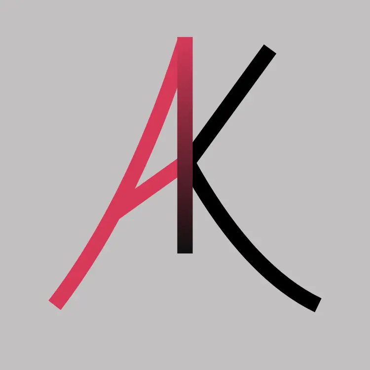

<h1 >I'm Abinash Kalita !</h1>
<h3 >Hay stranger, I'm a full-stack Web Developer with 4+ years of experience crafting user-centric web solutions using Django and PHP. Skilled in API integration, performance optimization, and solving complex challenges. Dedicated to delivering high-quality, scalable solutions. In my Frontend work, you can checkout my highly Animated creative designs!</h3>

  <ul>
    <li>🌱 I’m currently learning : AMP - A web development Framework , Three.js</li>
    <li>💻Visit my <a href="https://abikalita.in" target="_blank">Portfolio</a> for more details about me.</li>
  </ul>

---

### 🛠️ My Skills:
- **Front-End**: GSAP, Locomotive.js, ScrollTrigger, HTML, CSS, JavaScript, Tailwind CSS, Bootstrap  
- **Back-End**: Django, PHP, Django REST Framework
- **Databases**: MySQL, SQLite
- **Tools & Other Skills**: GitHub, Debugging, Responsive Web Design, Machine Learning (beginner), Payment Integration, Jquery
  
<h3 align="left"> 📫 How to reach me:</h3>

  
  
  

---

&nbsp;

<!--
**itz-A53-K/itz-A53-K** is a ✨ _special_ ✨ repository because its `README.md` (this file) appears on your GitHub profile.

Here are some ideas to get you started:

- 🔭 I’m currently working on ...
- 🌱 I’m currently learning ...
- 👯 I’m looking to collaborate on ...
- 🤔 I’m looking for help with ...
- 💬 Ask me about ...
- 📫 How to reach me: ...
- 😄 Pronouns: ...
- ⚡ Fun fact: ...
-->
